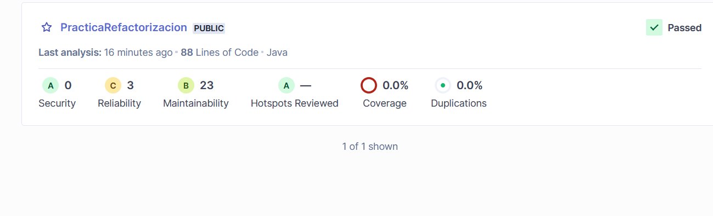
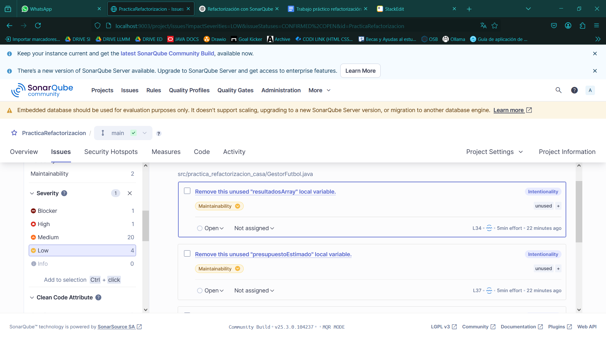

# Tarea 6.10: Refactorización

---

***Práctica realizada por Javier López Gutiérrez***

- Se ha creado un proyecto en local para la práctica de refactorización.

*ANTES DE EMPEZAR A DOCUMENTAR LA PRACTICA SE HAN SOLUCIONADO ALGUNAS ISSUES POR LO QUE NO SE VERAN REFLEJADAS EN LA DOCUMENTACIÓN*

## Analizar el código Facilitado:

Se han detectado las siguientes issues:

- **Blocker**:
  - **Remove this "clone" implementation; use a copy constructor or copy factory instead.**
    - Se ha reemplazado la implementación de `clone()` por un método de copia utilizando `super.clone()`, y se ha añadido la implementación de la interfaz `Cloneable` para permitir la clonación segura del objeto.
  
- **High**:
  1. [x] **Refactor this method to reduce its Cognitive Complexity from 18 to the 15 allowed.**
     - Se ha refactorizado el método `procesarTemporada()` dividiéndolo en varios métodos pequeños: `procesarResultado()`, `procesarPartidoLocalOVisitante()`, `clasificarPorLongitud()`, y `verificarEnfasis()`. Esto ha permitido reducir la complejidad cognitiva, haciendo el código más legible y fácil de mantener.

- **Medium**:
  1. [] **Remove this unused "partidosTotales" private field.**
     - Se ha eliminado el atributo `partidosTotales` de la clase, ya que no estaba siendo utilizado.
  2. [] **Remove this unused "nombreRealMadrid" private field.**
     - Se ha eliminado el atributo `nombreRealMadrid` que no era utilizado en ningún lugar de la clase.
  3. [] **Remove this unused "nombreAtleticoMadrid" private field.**
     - Se ha eliminado el atributo `nombreAtleticoMadrid`, también no utilizado en el código.
  4. [] **Replace this use of System.out by a logger.**
  5. [] **Replace this use of System.out by a logger.**
  6. [] **Replace this use of System.out by a logger.**
  7. [] **Replace this use of System.out by a logger.**
  8. [] **Replace this use of System.out by a logger.**
  9. [] **Replace this use of System.out by a logger.**
  10. [] **Replace this use of System.out by a logger.**
  11. [] **Replace this use of System.out by a logger.**
  12. [] **Replace this use of System.out by a logger.**
  13. [] **Replace this use of System.out by a logger.**
  14. [] **Replace this use of System.out by a logger.**
  15. [] **Replace this use of System.out by a logger.**
  16. [] **Replace this use of System.out by a logger.**
     - Las instancias de `System.out` se reemplazarán por un logger adecuado (por ejemplo, `Logger` de Java), para un manejo más flexible y profesional de los mensajes de salida en lugar de imprimir directamente en la consola.
  
- **Low**:
  1. [x] **Remove this unused "resultadosArray" local variable.**
     - Se ha eliminado la variable local `resultadosArray`, que no estaba siendo utilizada en el código.
  2. [x] **Remove this unused "presupuestoEstimado" local variable.**
     - Se ha eliminado la variable `presupuestoEstimado`, que tampoco era utilizada.
  3. [x] **This class overrides "equals()" and should therefore also override "hashCode()".**
     - Se ha añadido la implementación del método `hashCode()` para garantizar que, al sobrescribir el método `equals()`, se siga el principio de contrato de Java.
  4. [x] **Simply return -1.**
     - Se ha simplificado el retorno en un método para devolver solo `-1` donde era necesario, eliminando código innecesario.

## Refactorizar el código facilitado:

---

> "Quien tiene un porqué puede soportar casi cualquier cómo"  
> **- Friedrich Nietzsche**

---
